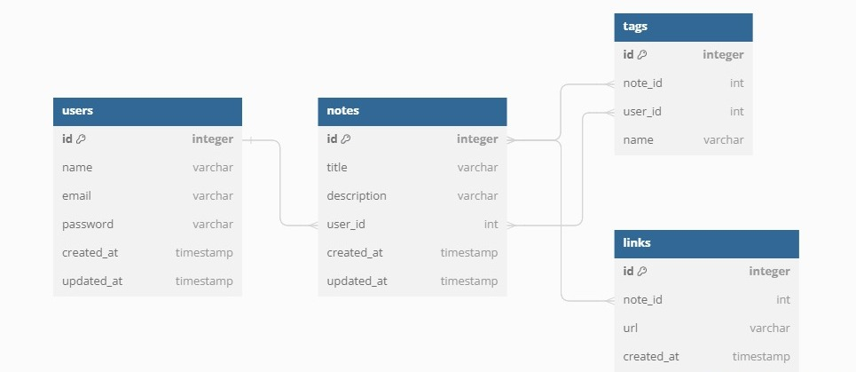

# Notes Management System

<p align="justify">
  This project is a backend API built with Node.js and Express, using the SQLite database to store information. 
  Interaction with the database is handled through Knex.js, which facilitates the execution of SQL queries. 
  The API allows users to create, organize and manage notes by associating them with tags and links. 
  Additionally, it offers advanced search functionality by keywords in the title or by tags, and 
  includes operations for creating, updating, listing and deleting users.
</p>


## Technologies Used

- **Node.js** - JavaScript runtime environment.
- **Express** – Web framework for Node.js.
- **SQLite** – Lightweight SQL database engine.
- **Knex.js** – SQL query builder and migration tool.


## Features
- **User Management:** Create, update, retrieve, and delete users.
- **Note Management:** Create, list, retrieve, and delete notes.
- **Tag & Link Association:** Associate notes with tags and links for better organization.
- **Advanced Search:** Filter notes by title keywords or associated tags.
- **Database Integration:** Uses SQLite with Knex.js for seamless database migrations and queries.


## Project Diagram
<div align="center">
  
</div>


## Getting started

### Prerequisites
  * Node.js installed on your machine.
  * A package manager (npm or yarn).


### Installation

```bash
# Clone the repository
git clone https://github.com/devmoreir4/notes-api-backend.git

# Navigate to the project directory
cd notes-api-backend

# Install dependencies
npm install

# Run database migrations
npm run migrate

# Start the application
npm start
```

## API Endpoints

| **Method** | **Endpoint**       | **Description**                                                     |
|------------|--------------------|---------------------------------------------------------------------|
| POST       | `/users`           | Creates a new user.                                                 |
| PUT        | `/users/:id`       | Updates an existing user's information.                             |
| GET        | `/users/:id`       | Retrieves a user's details.                                         |
| DELETE     | `/users/:id`       | Deletes a user.                                                     |
| GET        | `/tags/:user_id`   | Retrieves all tags associated with a user.                          |
| POST       | `/notes/:user_id`  | Creates a new note for a user.                                      |
| GET        | `/notes/:id`       | Retrieves a note by its ID.                                           |
| DELETE     | `/notes/:id`       | Deletes a note by its ID.                                             |
| GET        | `/notes`           | Lists notes based on query parameters (e.g., title, tags).            |


## Contribution
Contributions are welcome! Feel free to open **issues** or submit **pull requests** to contribute to the project.

## License
This project is licensed under the MIT License.
